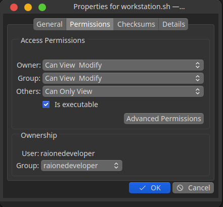
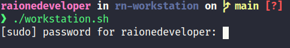

# Script Workstation
Esse é um script que utilizo para preparar a minha **workstation**, pode ser utilizado em todas as versões derivadas de *Debian*.

<br><br>

# Instalação

Antes de tudo abra o terminal, efetue o comando de atualização e depois reinicie o sistema operacional:

```
sudo apt-get update && sudo apt-get upgrade -y
```

Logo após efetue o clone via terminal utilizando o comando abaixo: 
**git clone https://github.com/RaioneNascimento/rn-workstation.git**


- Clique com o direito no arquivo workstation.sh e na aba **Permission/Permissão** ative a opção **Is Executable/Arquivo Executável**.

<div align="center">
  
</div>

<br>

Abra o arquivo diretamente no terminal, para isso, utilize os comandos na sequencia:

<ol>
  <li><i>cd /YOUR-PATH/rn-workstation</i></li>
  <li><i>./workstation.sh</i></li>
</ol>


Se tudo der certo, o terminal irá solicitar a senha *ROOT*. Caso apresente algum erro, verifique o procedimento de permissão citado anteriormente.

<br>
<div align="center">
  
</div>
<br>

# Lista dos programas

Esses são algum dos programas que utilizo no meu workstation e que está configurado no *script*:
<br><br>

  ### Programas em **.deb**:
  <br>

    - Google Chrome
    - Simple Notes
    - 4k Video Downloader
    - Insync
    - Microsoft Visual Studio Code
    - Devdocs
    - TeamViewer
    - GitHub Desktop

  ### Suporte aos Instaladores:
  <br> 

    - Snap
    - Curl

  ### Developer Kit
  <br>

    - Git
    - OhMyZsh
    - Nodejs
    - Yarn
    - Beekeeper studio
    - Insomnia
    - Gitkraken 
    - Android Studio
    - Slack
    - Figma

  ### Programas diversos:
  <br>

    - OBS studio
    - Discord
    - Telegram
    - PhotoGimp
    - Guvcview
    - FlameShot
    - Vlc Player
    - Thunderbird
    - Spotify
    - Jdownloader2 

<br>

## TODO
  - [x] ***Ubuntu 18.04.5 LTS*** - ***Ubuntu 20.04.1 LTS (Focal Fossa)***
  - [x] ***Kubuntu Kubuntu 18.04.5 LTS*** - ***20.04.1 LTS***

## 🙏 Considerações finais
<br>

Fique a vontade para copiar e fazer o seu próprio scrip.

***o aprendizado é contínuo e sempre haverá um próximo nível***.

`made with 💜 by raionedeveloper © 2020`